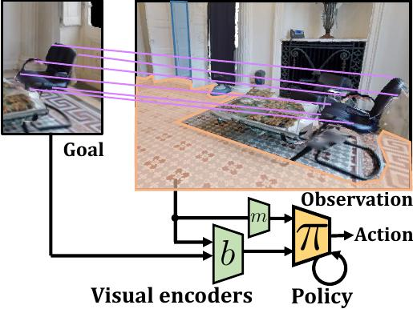
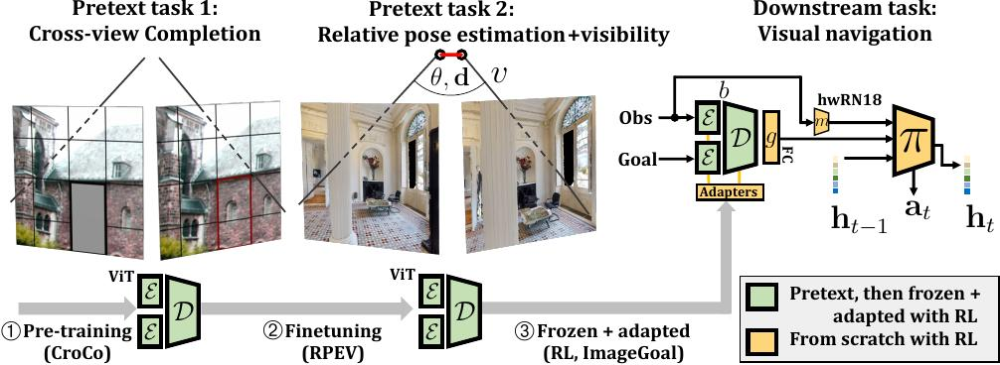

# Correspondence Pretext Tasks for Goal-oriented Visual Navigation

### TLDR: An end-to-end trained agent for image goal navigation

**(ICLR 2024)**


* [Slides](https://iclr.cc/virtual/2024/poster/18282)
* [OpenReview](https://openreview.net/forum?id=cphhnHjCvC)
* [ArXiv](https://arxiv.org/abs/2309.16634)

## Abstract

Most recent work in goal oriented visual navigation resorts to large-scale machine learning in simulated environments.
The main challenge lies in learning compact representations generalizable to unseen environments and in learning high-capacity perception modules capable of reasoning on high-dimensional input.
The latter is particularly difficult when the goal is not given as a category ("ObjectNav") but as an exemplar image ("ImageNav"), as the perception module needs to learn a comparison strategy requiring to solve an underlying visual correspondence problem.
This has been shown to be difficult from reward alone or with standard auxiliary tasks.
We address this problem through a sequence of two pretext tasks, which serve as a prior for what we argue is one of the main bottleneck in perception, extremely wide-baseline relative pose estimation and visibility prediction in complex scenes.
The first pretext task, cross-view completion is a proxy for the underlying visual correspondence problem, while the second task addresses goal detection and finding directly.
We propose a new dual encoder with a large-capacity binocular ViT model and show that correspondence solutions naturally emerge from the training signals.
Experiments show significant improvements and SOTA performance on the two benchmarks, ImageNav and the Instance-ImageNav variant, where camera intrinsics and height differ between observation and goal.



## Citation

```bibtex
@inproceedings{
    bono:24:imgnav:debit,
    title={
        End-to-End (Instance)-Image Goal Navigation
        through Correspondence as an Emergent Phenomenon
    },
    author={
        Guillaume Bono
        and Leonid Antsfeld
        and Boris Chidlovskii
        and Philippe Weinzaepfel
        and Christian Wolf
    },
    booktitle={The Twelfth International Conference on Learning Representations},
    year={2024},
    url={https://openreview.net/forum?id=cphhnHjCvC}
}
```

## Installation

1. Install [habitat-sim](https://github.com/facebookresearch/habitat-sim#installation):
```bash
conda create -n debit python=3.8 cmake=3.14.0
conda activate debit
conda install habitat-sim=0.2.3 headless -c aihabitat -c conda-forge
```
2. Install [habitat-lab](https://github.com/facebookresearch/habitat-lab#installation) with baselines:
```bash
mkdir deps
git clone https://github.com/facebookresearch/habitat-lab -b v0.2.3 deps/habitat-lab
cd deps/habitat-lab
pip install -e habitat-lab
pip install -e habitat-baselines
```
3. Clone [CroCo](https://github.com/naver/croco) repo and make it an installable package:
```bash
cd -
git clone https://github.com/naver/croco src/croco
find src/croco -type d -exec touch {}/__init__.py \;
find src/croco/models -name "*.py" -exec sed -ie 's/^from models/from /' {} \;
```
4. Install DEBiT and CroCo:
```bash
pip install -e .
```
5. Download pre-trained weights:
```bash
mkdir -p out/ckpt/hab_bl/imgnav
cd out/ckpt/hab_bl/imgnav
```
| Architecture |                             CroCo + RPEV + PPO(imgnav)                            |
| ------------ | --------------------------------------------------------------------------------- |
|   DEBiT-L    | `curl -LO https://download.europe.naverlabs.com/navigation/debit/debit_large.pth` |
|   DEBiT-B    | `curl -LO https://download.europe.naverlabs.com/navigation/debit/debit_base.pth`  |
|   DEBiT-S    | `curl -LO https://download.europe.naverlabs.com/navigation/debit/debit_small.pth` |
|   DEBiT-T    | `curl -LO https://download.europe.naverlabs.com/navigation/debit/debit_tiny.pth`  |


## Evaluation
```bash
cd -
python scripts/train_eval_ppo.py \
    --run-type eval \
    --exp-config configs/imgnav-gibson-debit.yaml \
    debit=debit_base \
    habitat_baselines.eval_ckpt_path_dir=out/ckpt/hab_bl/imgnav/debit_base.pth
```

## Training (3rd phase)



```bash
python scripts/extract_pretrained_croco_rpve.py
python scripts/train_eval_ppo.py \
    --run-type train \
    --exp-config configs/imgnav-gibson-debit.yaml \
    debit=debit_base \
    debit.pretrained_binoc_weights=weights/nle/checkpoints/croco-rpve/debit_base.pth
```
